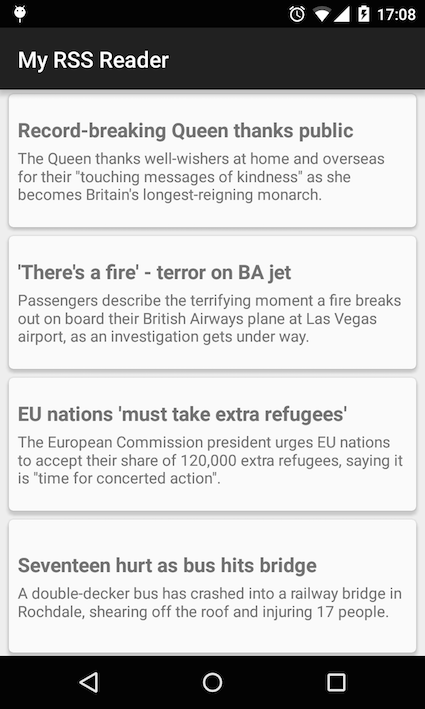
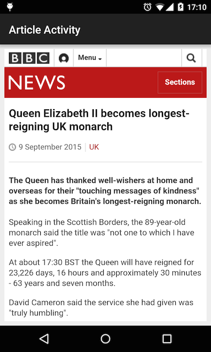

My RSS Reader
========
A simple demo Android app showing how to load and display an RSS feed. The app is written for those
new to Android development and thus it avoids using advanced techniques that might be more common in production
 ready apps.

It uses [Retrofit](http://square.github.io/retrofit/) and [Simple-XML](http://simple.sourceforge.net/)
 to fetch and parse the RSS feed items and it uses Android support library's [RecyclerView](https://developer.android.com/reference/android/support/v7/widget/RecyclerView.html)
 and [CardView](https://developer.android.com/reference/android/support/v7/widget/CardView.html)
 to display the items in a list.

 

 

License
-------

    Copyright 2015 Peter Tackage

    Licensed under the Apache License, Version 2.0 (the "License");
    you may not use this file except in compliance with the License.
    You may obtain a copy of the License at

       http://www.apache.org/licenses/LICENSE-2.0

    Unless required by applicable law or agreed to in writing, software
    distributed under the License is distributed on an "AS IS" BASIS,
    WITHOUT WARRANTIES OR CONDITIONS OF ANY KIND, either express or implied.
    See the License for the specific language governing permissions and
    limitations under the License.